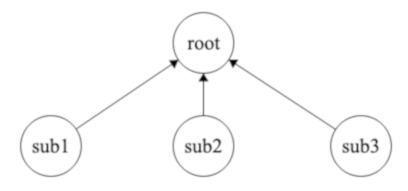

---
3ip: 4
title: 3ID the 3Box Identity System
author: oed@3box.io
discussions-to: https://chat.3box.io
status: Draft
created: 2019-05-09
---

## Simple Summary
This 3IP describes the DID method used in the 3Box protocol. It's called 3ID which is short for *3Box Identity*. DIDs are an emerging standard for [Decentralized Identities](https://identity.foundation/).

## Abstract
This 3IP describes the 3ID system. It's a DID method that allows 3Box to do granular access control where messages can be encrypted to a 3Box space of a user, from another user. This is achieved though a system of sub-DIDs which when resolved also points to the root-DID. A visualization of this can be seen below.

## Motivation
The motivation is critical for 3IPs that want to change the 3Box protocol. It should clearly explain why the existing protocol specification is inadequate to address the problem that the 3IP solves. 3IP submissions without sufficient motivation may be rejected outright.

## Specification

### 3ID identifier

A 3ID identifier would look like this:
`did:3:<cid>`

where `<cid>` is the content id of the DID document.

### Root DID

The root DID contains three keys. A `signing key`, a `management key`, and a `public encryption key`. These are the same keys as in the muport-did currently in use in 3Box. The root DID is in charge of the rootStore that keeps track of all spaces, as well as the main public profile of a users 3Box. All data updates are signed by the `signing key`.

Using the three keys above we create a [js-ipfs-did-document](https://github.com/3box/js-ipfs-did-document). This document should also include a version number at `0`.

#### Key rotations

Key rotations can be done using a simple ethereum smart contract (code [here](https://hackmd.io/pMydYCniQu2OMdyTApaqLw?both), but we need to add metaTxs). The contract stores data in the ethereum log system and we use the `management key` as the key that is allowed to rotate keys (the `management key` itself can also be replaced).

**Hard forks**

The key rotation system described above is secure but will not allow the scale we will likely need in the longer term. To deal with this we propose that we can do a hard fork to a more scaleable system. We would then define a blocknumber in the ethereum chain we will make the hard fork, take the state of the contract at that given block, and use it as the genesis state for our new key rotation system. Examples of more scaleable systems include plasma and or eth2, etc.

#### DID Document

We add three keys with ids:

- `signingKey` - the signing key
- `managementKey` - the management key
- `encryptionKey` - the public encryption key

### Sub DIDs

A sub DID is created for each space that a user has. This allows for greater access control when sending messages between users. Each sub DID has a `signing key` and a `public encryption key`, they also contain a proof signed by the root DID and a link back to the root DID. The `signing key` is used for all updates that is made to a space, both for a users data store as well as the users interactions in threads.

Sub DIDs also have a unique identifier just as the root DID, and when they are resolved their DID documents are merged into one.

#### DID Document

We add two keys with ids:

- `subSigningKey` - the signing key
- `subEncryptionKey` - the public encryption key

We also add two custom properties:

- `space` - the name of the space this sub DID represents
- `root` - IPLD link to the root DID
- `proof` - a signature by the root DID

**Format of proof**

The proof is a signature of the data in the sub DID by the `signing key` of the root DID. The data that needs to be signed is all of the properties described above, and possibly additional DID properties such as `@context` and timestamps etc. This data needs to be serialized in a deterministic way in order for the signature value to always be the same given the same data. the Verifiable Credential working group has some standards here and we should follow them if possible.

### DID resolver

The DID resolver is a function that takes a DID and resolves it to a DID Document. For 3ID it involves fetching an ipfs object, and checking a key revocation contract, and possibly resolving another ipfs object.

#### **Resolving a 3ID**

Here is the steps needed to resolve a 3ID. This includes both how to resolve a root, and a sub DID.

**Section A:**

1. Fetch the ipfs object with `cid1` which is in the identitfier: `did:3:<cid1>`
2. The resulting ipfs obect is an instance of js-ipfs-did-document
3. Get the public key with id `managementKey` from the DID document
4. If the `managementKey` is present it's a root DID, continue to *Section B,*
if it's not, continue to *Section C*

**Section B:**

1. Lookup the key revocation contract with the key from step 3
2. If 1 yields result it should be in the form of a new cid: `cid2`
    1. Fetch the ipfs object with `cid2` the resulting object should be the correct DID document
    2. Skip step 3
3. If 1 does not yield a result simply return the ipfs object from *Section A*

**Section C:**

1. The DID document from Section A should contain a property `root` with a CID (`cid3`) as value
2. Resolve the root DID Document starting from *Section A* using `cid3`
3. If keys had been rotated in *Section B*, continue to *Section D*
4. If not, merge the sub DID doc with the root DID doc and return it

**Section D:**

We now have the latest root DID doc, but we need to check if the sub DID doc has been updated.

1. Check the rootStore for if there has been an update to the given sub DID
2. If so, resolve this sub DID doc and merge it with our updated root DID doc and return it
3. If not, merge the current sub DID doc with the updated root DID doc and return it

### OrbitDB Identity Provider

The orbitdb identity provider allows us to have DIDs that act as external identities that provision keys that are used within the orbitdb system. The 3ID system should implement an odb-identity-provider that uses the [identityProviderInterface](https://github.com/orbitdb/orbit-db-identity-provider/blob/master/src/identity-provider-interface.js). The `getId` and `signIdentity` functions takes an options object, we should add the ability to pass a *space name* here which tells the identity provider which sub DID (or root DID) to use. The `verifyIdentity` function will then use the did-resolver to get the correct public key to verify an entry. Perhaps we can implement this as a generic DID identity provider for orbitdb if it's not too much additional work.

#### Signature type

The signature could be done by signing a JWT, however this would mean a lot of overhead, since it includes the payload as well. We likely want to use a more lightweight signature method. It would make sense to use the same thpe of signature as in the `proof` section above, i.e. one that is compatible with the Verifiable Credentials spec.

### Example use: Extended Space API

NOTE: This section is not a requirement for implementing 3ID, but serves as an example of the direction we can go in when we have the 3ID system in place.

We extend the spaces API by exposing an additional  `user` object. This object provides the developer with capabilities such as encrypting and decrypting messages, and signing an verifying claims.

**myAppSpace.user**

A new property on the space class, provides the user object.

**user.DID**

The sub-DID of the user for the given space.

**user.encryptTo(<did>, message, options)**

Asymmetrically encrypt a message to the given DID.

**user.encrypt(message, options)**

Symmetrically encrypt a message that only the user can decrypt. Options can contain options such as padding length, nonce, or even another key to do the symmetric encryption with.

**user.decrypt(encryptedDataObject, options)**

Decrypts a message. This function decrypts both symmetrically and asymmetrically encrypted messages.

**user.signClaim(claimData)**

Signs a claim with the users sub-DID. (Is a JWT claim for now)

**user.receiveClaim(claim, options)**

Verifies the claim and makes sure that it's issued to the user. Then stores the claim in the public or private store, depending on the options.

**user.validateClaim(claim)**

Validates a given claim

## Backwards Compatibility
Currently 3Box uses "muport" DIDs, when we start using the 3ID system we will need to keep the muport DIDs around for a while. Once 3ID has been around for a while it will be easier to remove the muport dependency, but there are likely some minor compatibility issues we need to solve.

## Copyright
Copyright and related rights waived via [CC0](https://creativecommons.org/publicdomain/zero/1.0/).
