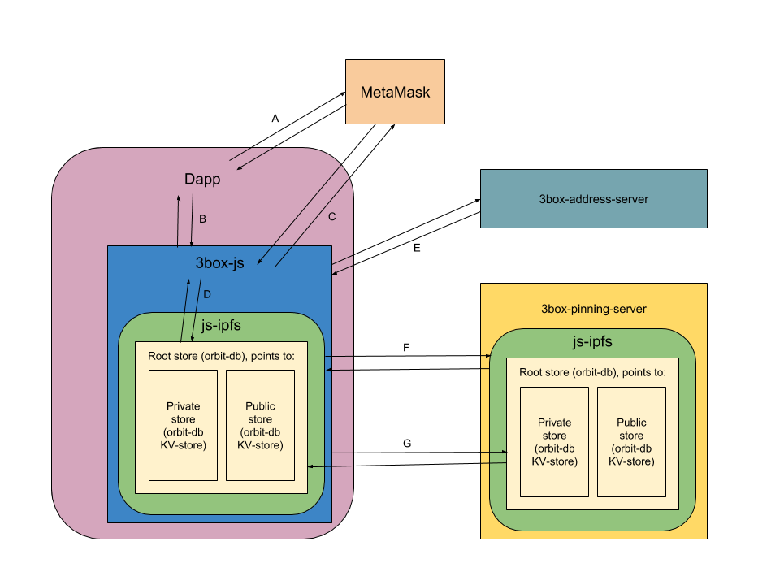

# 3Box Architecture
## Data Model
Each user has two data stores. One for public data and one for private data. To keep track of these data stores there is a root store that points to the addresses of the two data stores. The user only needs to have access to the address of the root store in order to fetch all of the database content from both the private and public stores.

When a new database for a user is created in the `3box-js` library a DID is derived from the users ethereum address. A mapping from the ethereum address to the DID and from the DID to the root store address are stored on the `3box-address-server`. This server also pins the ipfs data from the users stores so that it's always available.

### Access Control

The way that access control is done in the 3Box data store is by means of encryption. When the user interacts with a Dapp that needs to access data in the 3Box, a consent message is shown to the user in their Dapp browser (such as for instance [MetaMask](https://metamask.io)), and the user is asked to sign this message with their Ethereum private key. The signature is returned to the Dapp and the entropy in the signature is used to create key material. This key material generates an encryption key and a signing key.

The encryption key is used to decrypt data to allow the Dapp to read the data in the users Private store. The signing key is used to sign requests to the [Hash server](https://github.com/uport-project/3box-hash-server) which will update the users root hash on the server.

### Root Store
The root store is an orbitdb `feed`, basically a list of entries. The `feed` store allows us to add and remove entries. In our case we would add two entries to this feed, one for each store (with the possibility of adding more stores in the future).

The two entries would be the orbitdb addresses for the public and private stores. For example these could look like:
```
 /orbitdb/Qmd8TmZrWASypEp4Er9tgWP4kCNQnW4ncSnvjvyHQ3EVSU/<user-fingerprint>.public
```
for the public store and
```
 /orbitdb/Qmd8TmZrWASypEp4Er9tgWP4kCNQnW4ncSnvjvyHQ3EVSU/<user-fingerprint>.private
```
for the private store. Here `<user-fingerprint>` is the multihash of the users DID.


### Public Profile
The public profile store is a orbitdb keyvalue-store.

### Private Data Store
The private data store is an orbit-db KV-store with additional encryption.

#### Encryption
The encryption scheme for adding a key-value entry would work as follows:

* Generate a random salt and store it encrypted (see below) under the `3BOX_SALT` plain text key.
* Compute the `key` by taking `h(PLAIN_KEY | salt)`
* Generate a random nonce `n`
* Add padding to `PLAIN_VALUE` so that its length is a multiple of `24`
* Compute the ciphertext: `nacl.secretbox(PLAIN_VALUE, n, secretKey)`
* Encode `value` as `{ nonce: Base64(n), ciphertext: Base64(ciphertext) }`

We can now store `key` and `value` in the orbit-db KV-store using the `put` method.

Optionally we can add an index of encrypted keys to the db.

## How it Works
Here's a technical walk thorough of how the system works.



### Creating a user profile

**1.** (A) The dapp gets the users address from MetaMask (or any web3 compliant browser)

**2.** (B) Dapp request to open the users 3box

**3.** (C) `3box-js` request consent to open the box from the user. This is done by using the entropy from the signature to create a signing and an encryption key.

**4.** (D) `3box-js` creates the root, private, and public stores. Then dapp can then add data to these stores (B). The first time public data is added another request for consent is requested from the user, to link their ethereum address to their 3Box (C).

**5.** (E) `3box-js` sends the orbitdb address of the root store and the consent to make their profile public to the `3box-address-server`. It also sends the orbitdb address of the root store to the `3box-pinning-server` (F) over ipfs pubsub.

**6.** (F) Any updates that are made to any of the stores are replicated on the `3box-pinning-server` using orbitdb's internal replication system. This system uses ipfs pubsub to send the data between two ipfs nodes, which means that both nodes have to have the pubsub protocol enabled.


### Accessing user data

**1.** *Same as above*

**2.** *Same as above*

**3.** *Same as above*

**4.** `3box-js` opens the orbitdb stores, sends the root store address to the `3box-pinning-server` (F) and replicates the db data from the `3box-pinning-server` (G).

**5.** The dapp gets data from the box object (B).


### Getting a profile of an ethereum address

**1.** (B) Dapp requests to get profile of an ethereum address

**2.** (E) `3box-js` requests the orbitdb address of the given ethereum address from the `3box-address-server`

**3.** `3box-js` opens the orbitdb stores, sends the root store address to the `3box-pinning-server` (F) and replicates the db data from the `3box-pinning-server` (G).

**4.** `3box-js` returns the user profile to the dapp (B)
