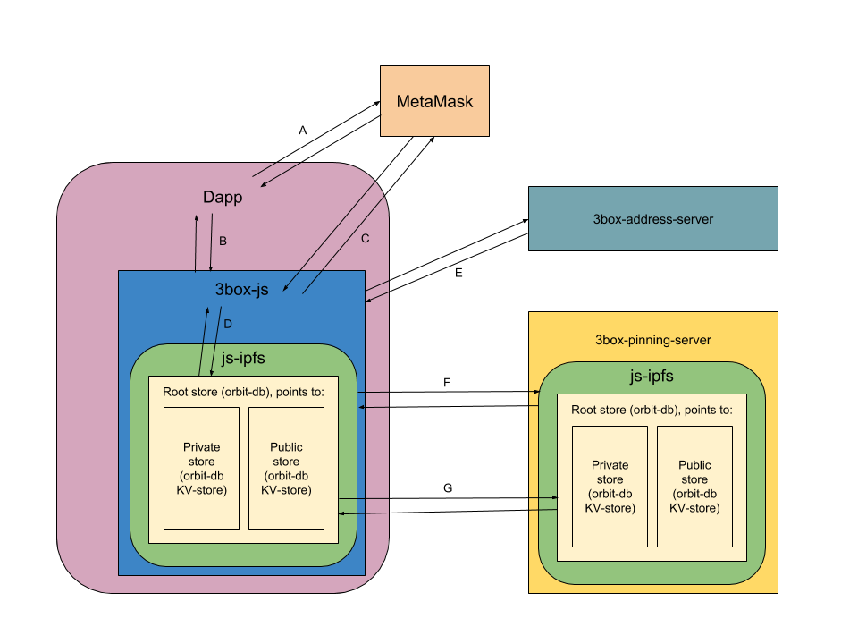

# 3Box
User-Managed Application Data for Web3.

[3box documents folder](https://drive.google.com/drive/folders/16lZWMVFLKLk2nAZJQ7xQyzHKZzK734Ov?usp=sharing)

## Technical specification
3box consists of two major components `3box-root-hash-tracker` which is a server component and `3box-js` which is a client side library. Together they are used to keep track of user data stored in `orbit-db` instances. Below are detailed specifications of how they are implemented.

### 3box-root-hash-tracker
The root hash tracker is a REST-API that is used to associate an ethereum address with an ipfs hash.

[*3box-root-hash-tracker specification*](./3BOX-ROOT-HASH-TRACKER.md)

### 3box-js
3box-js is the client side library used to read, write, and delete public and private data associated with the user.

[*3box-js data structure specification*](./3BOX-JS-DATA-STRUCTURE.md)

[*3box-js api specification*](./3BOX-JS-API.md)

## Architecture diagram
A high level overview of the 3box architecture. A brief description of all interactions follows below.

Each user has their own root ipfs object, and associated data stores. The hash of this object is stored in the `3box-root-hash-tracker`. The root-hash-tracker also stores a mapping from a DID that is created in the `3box-js` library to this hash, as well as a mapping between the users ethereum address to the DID.

**A.** The dapp gets the users address from MetaMask (or any web3 compliant browser)

**B.** Dapp request public or private data from the users 3box

**C.** 3box-js MM interactions
  1. 3box-js requests consent for storing and retrieving private and public data. The signature is used as key material when creating the 3box DID.
  2. 3box-js requests consent for linking the public profile to the users ethereum address

**D.** 3box-js stores and retrieves data from ipfs. Using two separate orbit-db instances for public and private data, and a separate ipfs objects which always links to the latest hash of the two orbit-db instances.

**E.** All ipfs data is automatically pinned in the infura ipfs cloud.

**F.** 3box-js root-hash-tracker interactions
  1. 3box-js publishes the link between ethereum address and DID
  2. 3box-js publishes a new root hash (this is the hash of the latest ipfs object linking to the two orbit-db instances)
