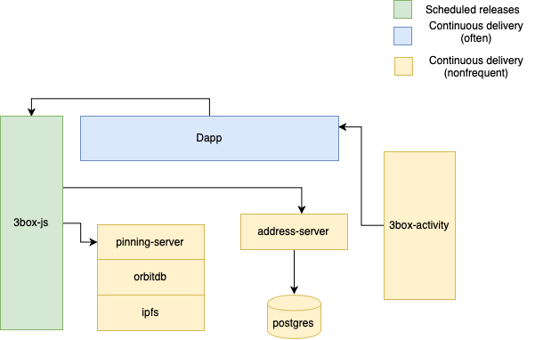

## Introduction

We will go into detail on our tech stack, breaking down components according to their type and responsibilities, answering the question if a fixed-schedule release applies or not, and if not, what are the best strategies for rollout and deliver value minimizing operational risk at the same time.

All of the time-frame release process share a same goal. They deliver a certain number of features (plus patches and security updates) in a fixed period of time (it can be bi-weekly, monthly, quarterly, and so on).

# Component breakdown

## **Libraries**

- 3box-js
- 3box-activity

Our core features for the people that are integrating with us, are delivered through the libraries. So, it makes sense to have a release schedule for this. Since we are on 2-week long sprints, it will make sense to leverage this cadence and make the library releases a ritual at the end of a sprint, for example.

**Proposal:** Schedule updates with a cadence that the team agrees on (at the end of every release or every other release). These releases will only include features, not bugfixes or security updates.

**Release process:** At the end of every release (after the sprint review and before the nexr sprint planning), follow the procedure:

- Create a release branch (release/x.y.z)
- Create release notes
- Merge those changes a master using `git-flow`
- Publish to npm

Ideally those steps (except for writing release notes could be automated in the near future)

create a release branch fr PR to master, tag accordingly and publish to npm automatically leveraging our CI integration.

**Benefits of this approach:**

- Delivering value periodically.
- Avoiding long-running features (white elephants).
- Minimize risk of releasing breaking-change features.
- Developers relying on us will know beforehand they may have to update their libraries

**Possible-side effects of this approach:**

- Feature creep.
- It may require code freeze so it can slow down development a bit.
- It will require dedication and commitment of the team to quality overall.

## **Servers:**

- address-server [to be deprecated]
- pinning-server

## caching-service

These services are the backbone in which our platform is built and scaled. The servers receive infrequent updates and those aren't usually tied with the product development per se (they bring stability, scalability, security). Forcing them to release on schedule doesn't make sense since the idea is to affect them as least as possible unless they improve some of the characteristics.

**Proposal:** Don't set a schedule to release server updates, unless if they are tied (or blocking) a given functionality implemented or required by the libraries.

**Release process:**  "1-Line" deploy. Make the deployment script available to the whole engineering team. The script should implement a rollback feature too. Test the changes in a small subset of servers, then apply it to all the server we have running.

**Benefits of this approach:** Releases are painless and can be executed at any time without downtime using an advance deployment configuration such as A/B deployment [3]

**Dapps (frontend):**

- 3box-dapp

The 3Box dapp delivers features to the end users (view/edit profile, activity and so on). The way the dapp interact with users is similar to a SaaS product. In those kinds of products, there is not a fixed schedule and the features are shipped to the users as soon as they are ready.

**Proposal**: Don't fix schedule dapp updates (unless a given feature is tied to any of the libraries). Feature-flag features and A/B test them instead, so it makes sense to release features one-by-one.

**Release process:** Release full features (ideally sequenced) using gitflow.

**Benefits of this approach:** Tag releases by the feature name, so it's easy to keep track of features at the dapp level. Also a reliable source to find regressions or other types of bugs.

# References

[1] Gitlab release process - [https://about.gitlab.com/2015/12/17/gitlab-release-process/](https://about.gitlab.com/2015/12/17/gitlab-release-process/)

[2] Ubuntu release process -  [https://wiki.ubuntu.com/TimeBasedReleases](https://wiki.ubuntu.com/TimeBasedReleases)

[3] Advanced deployment strategies - [https://docs.openshift.com/container-platform/3.6/dev_guide/deployments/advanced_deployment_strategies.html](https://docs.openshift.com/container-platform/3.6/dev_guide/deployments/advanced_deployment_strategies.html)